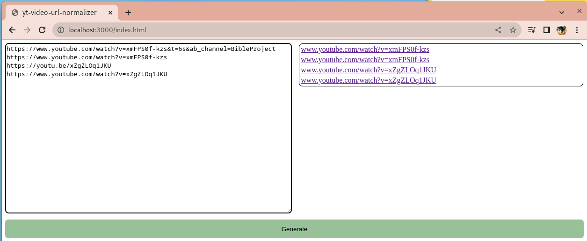

# yt-video-url-normalizer

I perform a repetitive function at work that requires youtube videos to end up in a common format.

This tool will read youtube video urls and output them in the format:

`www.youtube.com/watch?v=${videoId}`

In a single column table, aka its pastable into a spreadsheet thanks to rich text editing features.

If you find bugs, please make an issue and I'll address it.